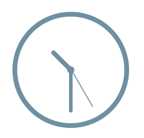

# Minimalist Analog Clock

This little library provides a CSS only solution to display a simple static analog clock.



## Usage

The minimalist analog clock package can be installed via [Bower](http://bower.io/):

```sh
> bower install --save minimalist-analog-clock
```

Include the provided `clock.css` or `clock.min.css` file in your project to display an analog clock for the following
HTML structure:

```html
<div class="minimalist-clock" data-hour="13" data-minute="37" data-second="0">
  <div class="minimalist-clock--face">
    <div class="minimalist-clock--hour"></div>
    <div class="minimalist-clock--minute"></div>
    <div class="minimalist-clock--second"></div>
  </div>
</div>
```

If you are interested in only hour hand and minute hand, just omit the `data-second` attribute and the element with
`minimalist-clock--second` class:

```html
<div class="minimalist-clock" data-hour="13" data-minute="37">
  <div class="minimalist-clock--face">
    <div class="minimalist-clock--hour"></div>
    <div class="minimalist-clock--minute"></div>
  </div>
</div>
```

If you want the clock to be updated automatically, you have to provide a few lines of Javascript. Just update the
`data`-attributes regularly:

```javascript
(function () {

  window.setInterval(function () {
    var date = new Date();

    var clock = document.getElementsByClassName('minimalist-clock')[0];

    clock.setAttribute('data-hour', date.getHours());
    clock.setAttribute('data-minute', date.getMinutes());
    clock.setAttribute('data-second', date.getSeconds());
  }, 1000);

})();
```

## Development

To provision your environment, just run:

```sh
> npm install
```

This will ensure that [Grunt](http://gruntjs.com) is installed. This allows you to see a live demo while developing.
Simple run:

```sh
> grunt serve
```

For further details take a look at the `Gruntfile.js`.
